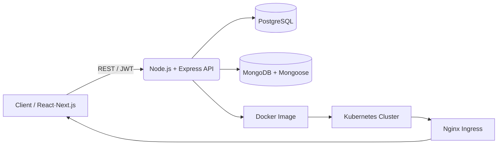

<div align="center">


</div>

<br/>

## 🧭 About Me

<div align="center">

> *"Great software isn't judged by what it builds — it's judged by what breaks it."*
> **I design for the second reading, not just the first demo.**

</div>

<table>
<tr>
<td width="50%" valign="top">

### 👤 Quick Facts

| | |
|---|---|
| 🎓 **University** | Jamhuriya University |
| 📘 **Degree** | B.Sc. Computer Science *(Expected 2030)* |
| 🌍 **Location** | Somalia 🇸🇴 |
| 🗣️ **Languages** | Somali · Arabic · English (B2) |
| 🎯 **Status** | Open to remote work |


</td>
<td width="50%" valign="top">

### ⚡ Currently

```diff
+ Deepening backend fluency: C → JS/TS → Go
+ Orchestrating apps with Kubernetes
+ Balancing PostgreSQL & MongoDB in real projects
~ Always reading up on OWASP Top 10
```

</td>
</tr>
</table>

<br/>

<table>
<tr>
<td width="25%" align="center">

### 🚀
**Full-Stack**
End-to-end delivery — schema to shipped UI.

</td>
<td width="25%" align="center">

### 🔐
**Security-First**
JWT, bcrypt, OWASP baked in, not bolted on.

</td>
<td width="25%" align="center">

### 🐳
**Cloud-Native**
Docker images, Kubernetes-ready by default.

</td>
<td width="25%" align="center">

### 🗄️
**Polyglot Data**
PostgreSQL & MongoDB, whichever fits the shape.

</td>
</tr>
</table>

<br/>

<div align="center">

</div>

## 🛠️ Tech Stack

<div align="center">

### Languages


### Frontend


### Backend & APIs


### Databases


### DevOps & Infrastructure


### Tools & Platforms


</div>

<br/>

<div align="center">

</div>

## 🏗️ How I Build

<div align="center">



</div>

Every project ships with a `Dockerfile`, sensible environment separation, and — where it matters — Kubernetes manifests (Deployment, Service, Ingress) so what runs on my machine is the same thing that runs in production.

<br/>

<div align="center">

</div>

## 🎓 Certifications

<div align="center">


</div>

<br/>

<div align="center">

</div>

## 📊 GitHub Stats

<div align="center">
  
  
</div>

<div align="center">
  
</div>

<div align="center">
  
</div>

<div align="center">
  
</div>

<br/>

<div align="center">

</div>

## 🌐 Connect With Me

<div align="center">
  <a href="mailto:engsaciidessa@gmail.com">
    
  </a>
  <a href="https://wa.me/252619534384">
    
  </a>
  <a href="https://www.linkedin.com/in/saeed-mohamed-essa-507153384/">
    
  </a>
  <a href="https://www.instagram.com/sac11d/">
    
  </a>
  <a href="https://github.com/engsac11d">
    
  </a>
</div>

<br/>

<div align="center">
  
</div>
